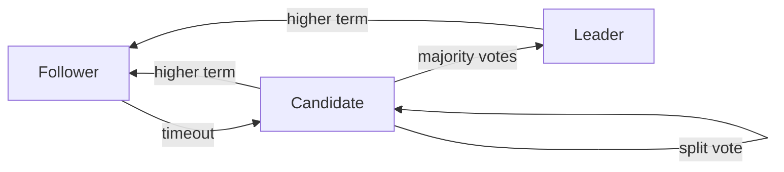
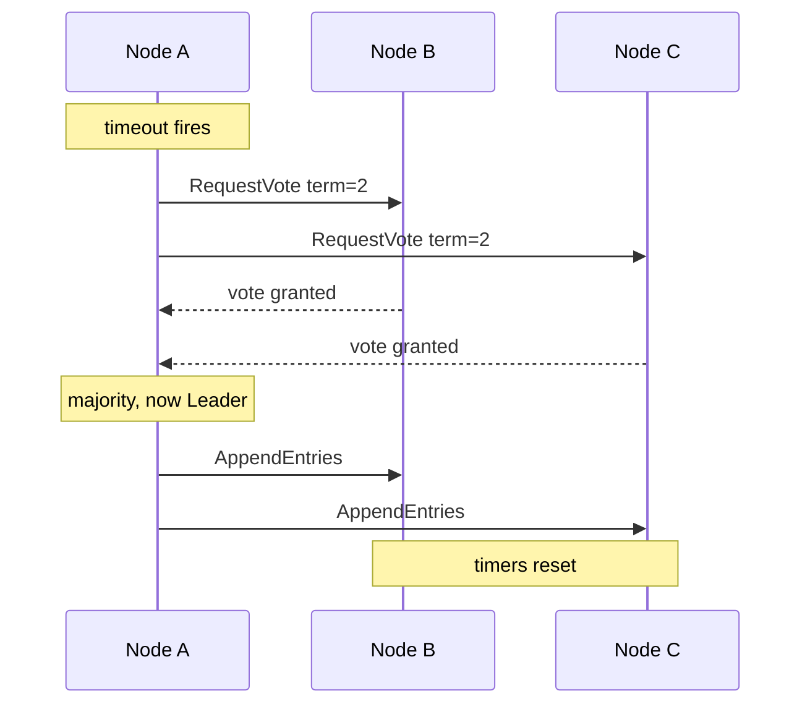

# Design Decisions

Notes on choices that actually matter for correctness. Updated as we go.

---

## Architecture

```
+---------------------------+
|        server.go          |
|   networking, RPC, I/O    |
+-----------+---------------+
            |
+-----------v---------------+
|       consensus.go        |
|   pure algorithm, no I/O  |
+---------------------------+
```

ConsensusModule is the algorithm. Server is the network layer. They don't know each other's internals.

The reason for this split is testability. In consensus_test.go we can run a full multi-node cluster in a single process by having modules call each other's methods directly, no real sockets needed. Without this separation every test needs real networking and timing, which makes bugs much harder to reproduce.

---

## State Machine



---

## Election Flow



---

## Why strict majority (n/2 + 1)

A candidate needs more than half the cluster, not just half.

Two majorities in the same cluster always overlap by at least one node, and that node can only vote once per term. So you can never have two candidates both reach majority at the same time. Without this you could elect two leaders in the same term, which means two different entries committed at the same log index. That is the one thing Raft cannot allow.

A 5 node cluster tolerates 2 failures. Adding nodes improves fault tolerance but raises the votes needed to commit anything, which slows things down.

---

## What gets persisted

Only three fields are written to disk before replying to any RPC: currentTerm, votedFor, log[].

Each one protects something specific:

- currentTerm: if a node restarts at term 0 it will accept messages from leaders it should reject and vote in terms it already participated in. Terms are how the whole cluster agrees on who is authoritative.
- votedFor: without this a node that crashes after voting can restart and vote again in the same term. In a small cluster that can give two candidates a majority at once.
- log[]: committed entries live here. Losing it means losing committed data.

commitIndex and lastApplied are not persisted because they can be reconstructed by replaying the log on restart.

The tradeoff is that every RPC reply requires a disk write first. This is the main performance bottleneck in Raft.

---

## Timing: heartbeat vs election timeout

Heartbeat: 50ms. Election timeout: 150 to 300ms, randomized per node.

The heartbeat interval needs to be well below the election timeout. If a heartbeat is slow and the timeout fires, you get an unnecessary election even though the leader is still alive. The ratio matters more than the actual values.

The randomization is what prevents split votes. If every node had the same timeout they would all call elections at the same time every time the leader died, and you would get repeated splits with no winner. Staggering the timeouts means one node almost always fires first and wins before others wake up.

---

## Higher term always wins

Whenever any node sees a term higher than its own in any RPC, it immediately steps down to Follower and updates its term.

This is how Raft prevents stale leaders. A leader that got partitioned could come back thinking it is still in charge. If the rest of the cluster elected a new leader at a higher term, the old one needs to step down the moment it sees that term. Without this rule you can have two nodes both thinking they are leader.

This applies on both requests and responses, for any RPC type.

---

## Networking: net/rpc

Using Go's standard library net/rpc.

The handler signature Raft needs is `func (s *T) Method(args T, reply *T) error`, which is exactly what net/rpc expects. Zero dependencies, no adapter code.

For a production system we would use gRPC. It is cross-language, has TLS, retry, and observability built in. net/rpc is Go only and deprecated upstream. The plan is to start with net/rpc to understand what is happening under the hood, then migrate to gRPC.

---

## References

- [Raft paper](https://raft.github.io/raft.pdf)
- [Go net/rpc](https://pkg.go.dev/net/rpc)
