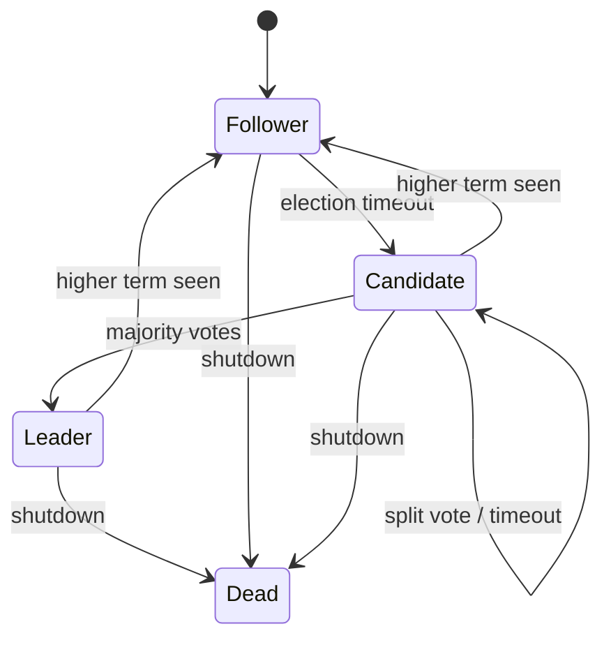
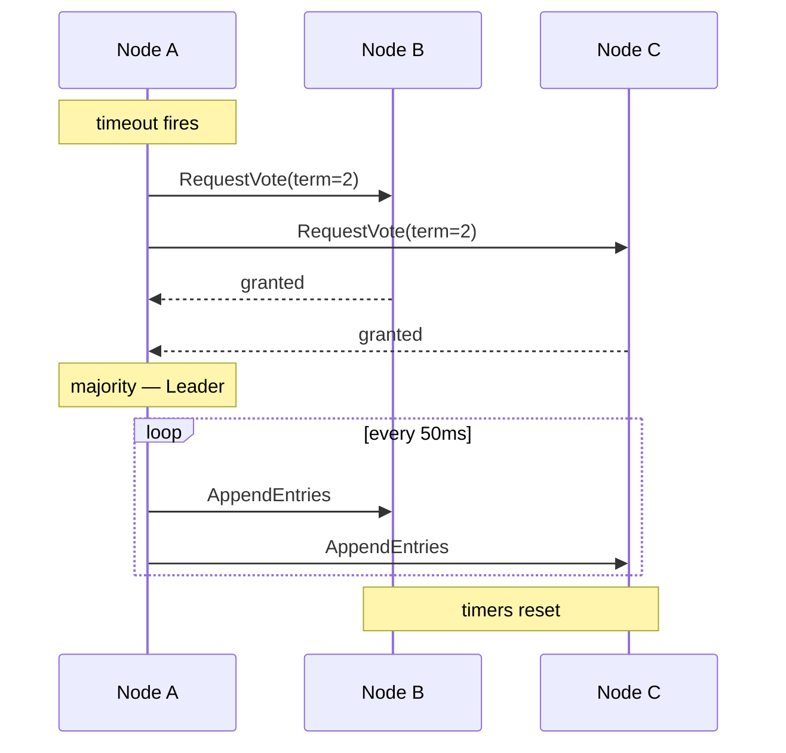

# Design Decisions

Key architectural and algorithmic decisions made in this Raft implementation. This is not a Go style guide — it covers choices that directly affect correctness, safety, or liveness of the consensus protocol.

---

## System Overview

```
┌─────────────────────────────────────┐
│             server.go               │
│      networking · RPC · I/O         │
└──────────────┬──────────────────────┘
               │
┌──────────────▼──────────────────────┐
│           consensus.go              │
│     algorithm · no net · no I/O     │
└─────────────────────────────────────┘
```

`ConsensusModule` is pure algorithm. `Server` is pure networking. Neither knows about the other's internals.

---

## Node State Machine



---

## Election Sequence



---

## Decisions

### 1. Separating algorithm from networking

The `ConsensusModule` has no network code. The `Server` has no algorithm code.

**Why it matters:** This is the only way to test Raft without a real network. In `consensus_test.go`, multiple `ConsensusModule` instances call each other's methods directly in one process — no sockets, no ports, no timing issues. Without this separation, every test would require spinning up real servers and you'd spend more time debugging networking than debugging Raft.

**Tradeoff:** The server layer is extra code to build and wire up.

---

### 2. Strict majority quorum (`n/2 + 1`)

A leader is elected only when it receives votes from more than half the cluster, not half.

**Why it matters:** This is the core safety property of Raft. Two different candidates can never both reach majority at the same time because any two majorities in the same cluster must overlap by at least one node — and that node only votes once per term. Without strict majority, you could elect two leaders in the same term, which would allow two different entries to be committed at the same log index.

For a 5-node cluster: majority = 3. Any two sets of 3 nodes share at least 1 node.

**Tradeoff:** The cluster can only tolerate `(n-1)/2` failures. A 5-node cluster tolerates 2 failures. Adding nodes improves fault tolerance but increases the votes needed to commit anything.

---

### 3. What gets persisted — and why exactly those three fields

Only `currentTerm`, `votedFor`, and `log[]` are written to durable storage before replying to any RPC.

**Why it matters:** Each field protects a specific safety property:

- **`currentTerm`** — if a node restarts with term 0, it will accept RPCs from old leaders it should reject and grant votes in terms it already participated in. Terms are the logical clock of the whole system.
- **`votedFor`** — without this, a node that crashes after voting can restart and vote again in the same term. In a small cluster this can give two candidates a majority simultaneously — two leaders, split brain.
- **`log[]`** — the log is the source of truth for what has been committed. Losing it means losing committed data.

`commitIndex` and `lastApplied` are *not* persisted because they can be reconstructed by replaying the log on restart.

**Tradeoff:** Every RPC reply requires a disk write first. This is the main performance bottleneck in Raft implementations.

---

### 4. Election timeout range and its relationship to heartbeat interval

Election timeout: **150–300ms** (randomized). Heartbeat interval: **50ms**.

**Why it matters:** The ratio between these two numbers determines whether the system stays stable.

The heartbeat interval must be significantly shorter than the election timeout — otherwise a slow heartbeat causes a follower to start an unnecessary election even though the leader is alive. The rule of thumb from the paper is:

```
heartbeat interval << election timeout << MTBF
```

Where MTBF is the mean time between server failures. If your election timeout is shorter than a typical network round trip, you'll have constant elections. If it's longer than MTBF, a leader failure will go undetected for too long.

The randomization within the timeout window (150–300ms) is what prevents split votes — if all nodes had the same timeout, they'd all call elections simultaneously every time the leader died.

**Tradeoff:** Wider timeout range = fewer split votes, but slower failover. Tighter range = faster failover, more split votes.

---

### 5. Higher term always wins — immediately

Whenever any node sees a term higher than its own in *any* RPC (request or response), it immediately reverts to Follower and updates its term.

**Why it matters:** Terms are Raft's mechanism for detecting stale leaders. Without this rule, an old leader that was partitioned could come back and think it's still in charge, issuing writes that conflict with a newer leader. The higher-term-wins rule ensures there's always a single source of truth about who is authoritative.

This applies everywhere — not just in `RequestVote`. A leader that gets an `AppendEntries` reply with a higher term must step down immediately.

**Tradeoff:** None. This rule has no downside — it is a hard correctness requirement.

---

### 6. `net/rpc` over gRPC

Standard library `net/rpc` for inter-node communication rather than gRPC.

**Why it matters for this project:** `net/rpc` requires zero dependencies and the handler signature it expects — `func (s *T) Method(args T, reply *T) error` — is exactly what Raft's RPC handlers look like anyway. There's no adapter layer to write.

**Why this would change in production:** `net/rpc` is Go-only, has no built-in TLS, no middleware, no retry logic, and is effectively deprecated in the Go ecosystem. A production Raft implementation would use gRPC for interoperability and observability, or a custom binary protocol for performance.

---

## What's Not a Design Decision

The following are Go implementation details, not Raft decisions. They affect code quality but not protocol correctness:

- Using `-1` as a sentinel for `votedFor` vs a nil pointer
- Using a tick-based timer loop vs `time.Timer`
- Passing `peerId` as a goroutine argument to avoid closure capture

---

## References

- [In Search of an Understandable Consensus Algorithm — Ongaro & Ousterhout (2014)](https://raft.github.io/raft.pdf)
- [Go net/rpc](https://pkg.go.dev/net/rpc)
