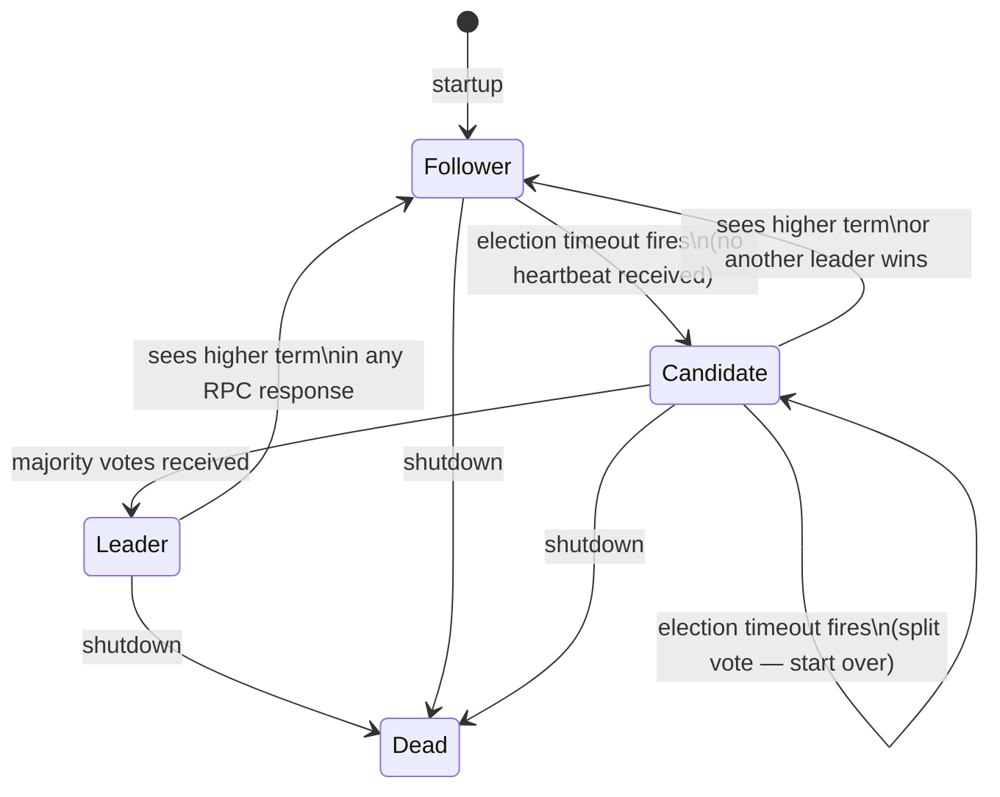
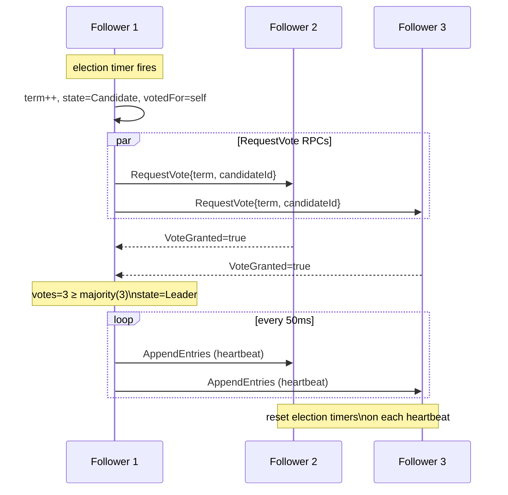

# Design Decisions

Design choices made during implementation of the Raft consensus algorithm in Go. Each decision includes context, rationale, and tradeoffs. Updated as the implementation evolves.

---

## Architecture

The implementation is split into two layers:

```
┌─────────────────────────────────────┐
│             server.go               │
│   net/rpc · listeners · dialers     │
└──────────────┬──────────────────────┘
               │ calls into
┌──────────────▼──────────────────────┐
│           consensus.go              │
│  pure algorithm · no I/O · no net   │
└─────────────────────────────────────┘
```

`ConsensusModule` owns the algorithm — state transitions, voting logic, log management. It knows nothing about sockets or serialization.

`Server` owns the network — RPC registration, listeners, dialing peers. It calls into `ConsensusModule` when messages arrive.

**Why this matters for testing:** multiple `ConsensusModule` instances can call each other's methods directly in a single test process, without any real networking. This is how `consensus_test.go` works.

---

## Node State Machine



---

## Election Sequence



---

## Design Decisions

### State Representation

#### `votedFor` — sentinel value vs pointer

Use `-1` to represent "no vote cast this term" rather than `*int` with `nil`.

| | |
|---|---|
| **Rationale** | No nil checks scattered through the codebase. Easier to serialize to disk when persistence is added. |
| **Tradeoff** | Magic number. A nil pointer is semantically clearer — it literally means "no value." |

#### Mutex over channels

Embed `sync.Mutex` directly on `ConsensusModule` rather than using channels as the coordination primitive.

| | |
|---|---|
| **Rationale** | Raft state transitions are straightforward reads and writes to shared fields. A mutex maps cleanly onto this model. Go's race detector catches misuse clearly. |
| **Tradeoff** | The struct must never be copied (Go vet enforces this). Mutex deadlocks can be harder to trace than channel deadlocks. |

---

### Election Timer

#### Tick-based loop over `time.Timer`

Sleep 10ms per iteration and check `time.Since(lastHeartbeat)` rather than using a `time.Timer` channel.

| | |
|---|---|
| **Rationale** | Simpler reset — just update `lastHeartbeat` on heartbeat receipt. Safely resetting `time.Timer` requires draining its channel first, which is easy to get wrong. |
| **Tradeoff** | ~10ms granularity on timeout precision. Fine for a 150–300ms window. |

#### Re-randomize timeout per iteration

Pick a new random timeout on each loop check, not once at startup.

| | |
|---|---|
| **Rationale** | Nodes that start together would time out together with a fixed timeout, causing repeated split votes. Re-randomizing each iteration staggers them across elections, not just at startup. |
| **Tradeoff** | Timeout window is not fixed per election — harder to reason about worst-case election latency. |

---

### Concurrency

#### Mutex released before any outgoing RPC

Always unlock before making a network call — read needed state into locals first, then release.

```go
// correct pattern
cm.mu.Lock()
term := cm.currentTerm
cm.mu.Unlock()
// make RPC call with term
```

| | |
|---|---|
| **Rationale** | RPC calls block for an indeterminate time. Holding the mutex during a network call freezes every goroutine trying to process an incoming RPC — effectively halting the node. |
| **Tradeoff** | State can change while the RPC is in flight. Must re-check `currentTerm` and `state` after every response before acting on it. |

#### `peerId` passed as goroutine argument

```go
// wrong — all goroutines share the same peerId variable
for _, peerId := range cm.peers {
    go func() { use(peerId) }()
}

// correct — value is captured at launch time
for _, peerId := range cm.peers {
    go func(peerId int) { use(peerId) }(peerId)
}
```

| | |
|---|---|
| **Rationale** | Closing over a loop variable means all goroutines share the same variable. By the time they execute, the loop has already advanced — every goroutine gets the last value. |
| **Tradeoff** | Slightly more verbose. The bug it prevents is subtle enough to reintroduce without knowing the reason. |

#### `leaderHeartbeat` launched with `go`

```go
if votes >= majority {
    cm.state = Leader
    go cm.leaderHeartbeat() // must be non-blocking
}
cm.mu.Unlock() // this must run
```

| | |
|---|---|
| **Rationale** | `leaderHeartbeat` runs an infinite loop. Calling it without `go` while holding the mutex blocks forever — the `Unlock()` on the next line never runs. Deadlock. |
| **Tradeoff** | None. This is always the correct pattern for long-running background work. |

---

### Networking *(planned)*

#### `net/rpc` over gRPC

| | |
|---|---|
| **Rationale** | Zero external dependencies. The RPC handler signature Raft needs — `func (s *T) Method(args T, reply *T) error` — is exactly what `net/rpc` expects with no adapter layer. |
| **Tradeoff** | Not cross-language. No streaming, middleware, or built-in retry. gRPC would be the production choice — this is a learning-project tradeoff. |

---

## References

- [In Search of an Understandable Consensus Algorithm — Ongaro & Ousterhout (2014)](https://raft.github.io/raft.pdf)
- [Go net/rpc](https://pkg.go.dev/net/rpc)
- [The Go Memory Model](https://go.dev/ref/mem)
